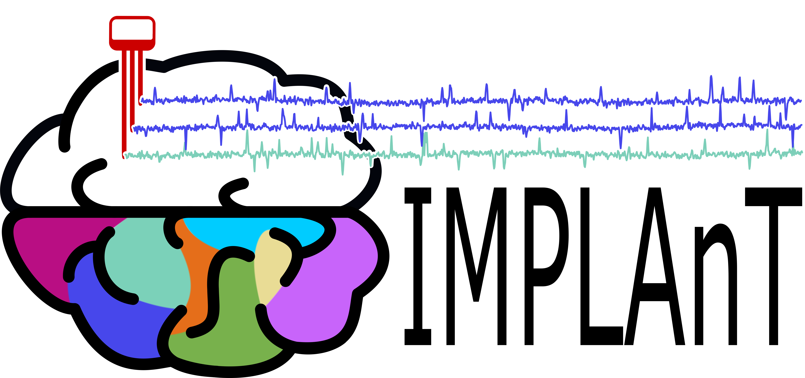
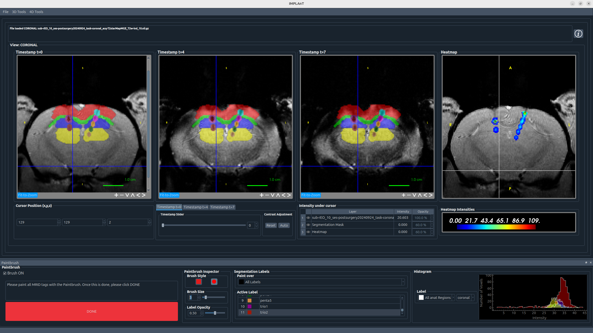

# IMPLAnT - Integrated Multimodal Planning, Localisation, Analysis Toolbox


Intracranial electrode implantation involves three distinct workflows: surgical planning, post-implant electrode localisation, and electrophysiological analysis. Currently, these steps are carried out through disconnected tools and custom scripts.
IMPLAnT is an open-source graphical user interface (GUI) that unifies all three stages into one single, cohesive platform improving both reproducibility and efficiency.

Currently, the GUI contains the following functions:

- **Pre-surgical planning** - register subject MRI data to the WHS brain atlas, letting you plan and visualise electrode trajectories before surgery
- **Post-implant localisation** - uses semi-supervised pipeline for MR identification tags to localise electrodes after implantation and automatically assign atlas-defined region labels to each channel to facilitate a more accurate analysis 
- **Electrophysiology data visualisation** - visualises and curates signal data channel-by-channel, directly linked to the anatomical labels from previous steps

Electrophysiology data preprocessing and analysis is planned for a future release.
As far as we are aware, IMPLAnT is the first open-source tool to bridge this entire pipeline in one interface. It is released fully open-source and designed to adapt to a range of experimental protocols.


## Screenshots

**Pre-surgical trajectory planning** — plan and visualise electrode trajectories across axial, sagittal, and coronal views of the WHS rat brain atlas, with individual shanks labelled directly in 3D.


**Post-implant electrode localisation** — paint anatomical regions and electrode traces across the post-implant MRI, generating a heatmap that is used to automatically assign each recording channel to its atlas-defined brain region.




**Electrophysiology visualisation** — view raw signal traces colour-coded by atlas region alongside a 3D rendering of the implanted electrodes, with per-channel anatomical labels and coordinates.


## Requirements

- **OS**: Linux (tested on Ubuntu 24)
- **Python**: 3.10 (from source only)
- **ANTs**: required by all users (see [Dependencies](#dependencies))

## Release

Pre-built standalone executables for **Linux** are available on the [Releases page](../../releases). No Python installation is required — download the executable, install ANTs, and configure `paths_config.json` as described in [Configuration](#configuration).

## Installation

Choose one of two options:
- **Download the release** from the [Releases page](../../releases) — no Python installation needed
- **Run from source** — requires Python 3.10 and all dependencies

Regardless of which option you choose, **ANTs must be installed separately** (see [Dependencies](#dependencies)).

### Dependencies
IMPLAnT requires **ANTs** (Advanced Normalization Tools) for MRI registration. ANTs is not a Python package and must be installed separately by all users.

1. Download ANTs from the [ANTs releases page](https://github.com/ANTsX/ANTs/releases)
2. Place the ANTs binaries so that the folder structure looks like this:

   **From source:**
   ```
   IMPLAnT/
     ants/
       bin/
         antsRegistration
         antsApplyTransforms
         ...
   ```

   **Standalone application:**
   ```
   IMPLAnT  (executable)
   ants/
     bin/
       antsRegistration
       antsApplyTransforms
       ...
   ```

### From source
1. Clone the repository
   ```
   git clone git@github.com:Neurotechnology-at-ETH-Zurich/IMPLAnT.git
   ```
2. Install dependencies
   ```
   cd IMPLAnT
   pip install -r requirements.txt
   ```
3. Install ANTs as described above

4. Run the app
   ```
   python main_window.py
   ```
   Alternatively, in Qt Creator: open the project and press Ctrl+R

### Standalone application

1. Install ANTs as described above
2. Build the executable
   ```
   pyinstaller MRID_GUI.spec
   ```
3. The app is created at `dist/IMPLAnT`
4. Place the `ants/bin/` folder next to the executable as described in [Dependencies](#dependencies)

## Configuration

### Atlas files

IMPLAnT uses the [Waxholm Space (WHS) rat brain atlas](https://www.nitrc.org/projects/whs-sd-atlas). Download the following files and place them in a folder of your choice:

| File | Description |
|------|-------------|
| `WHS_SD_rat_atlas_v4.nii.gz` | Atlas volume |
| `WHS_SD_rat_atlas_v4.label` | Region labels |
| `WHS_SD_rat_T2star_v1.01.nii.gz` | Template |
| `WHS_SD_rat_DWI_v1.01.nii.gz` | DWI template |
| `WHS_SD_v2_brainmask_bin.nii.gz` | Brain mask |

**This step is required — the app will not load atlas data without it.**

Copy `paths_config.example.json` to `paths_config.json` and edit it to match your local setup:

```bash
cp paths_config.example.json paths_config.json
```

Open `paths_config.json` and replace the placeholder values:
- `atlas_folder`: path to the folder where you saved the atlas files above
- `raw_base`: root directory where raw Bruker data is stored and BIDS output will be written

```json
{
    "ants_bin": "ants/bin",
    "raw_base": "/path/to/raw/data/",
    "atlas_folder": "/path/to/atlas/folder",
    "atlas_volume": "WHS_SD_rat_atlas_v4.nii.gz",
    "atlas_labels": "WHS_SD_rat_atlas_v4.label",
    "atlas_dwi": "WHS_SD_rat_DWI_v1.01.nii.gz",
    "atlas_template": "WHS_SD_rat_T2star_v1.01.nii.gz",
    "atlas_mask": "WHS_SD_v2_brainmask_bin.nii.gz"
}
```

- **From source**: place `paths_config.json` in the repository root
- **Standalone app**: place `paths_config.json` in the same folder as the `IMPLAnT` executable

### MRID library file

The electrode localization feature requires `mrid_library.pkl`, a lookup file specific to your experimental setup. Place it in the repository root (next to `main_window.py`) or next to the `IMPLAnT` executable. If no file is found, you will be prompted to browse for it manually.

A dummy `mrid_library.pkl` is included in this repository for testing. It contains placeholder entries for all four supported MRID types (`duo`, `trio`, `quad`, `penta`) with uniform geometry values and can be used to verify the localisation pipeline without real calibration data. Replace it with your own calibrated file before running actual experiments.

### Bruker scanner (optional)

If you are fetching raw data directly from a Bruker MRI scanner, create a file `samri/bruker_info.json` with your scanner's hostname and password:
```json
{
    "server": "your-scanner-hostname",
    "password": "your-password"
}
```
This file is gitignored and never shared. If you don't use a Bruker scanner, you can skip this — the fields will simply be left blank in the UI.

## Data Folder Structure

IMPLAnT expects your session data to follow this folder structure. The app derives paths automatically from the file you load, so keeping this layout is important for registration and localisation to work correctly.

```
your-session/
  anat/
    sub-001_T1w_ind_0.nii.gz          ← pre-surgical MRI (main file)
    sub-001_T2w_ind_1.nii.gz          ← post-implant MRI (added via Load Another MRI Image)
    transformation_ind_1-to-ind_0.txt ← registration output (auto-generated)
  registration/                       ← SAMRI registration output (auto-generated)
  analysed/                           ← localisation outputs (auto-generated)
  ephys/
    recording.dat                     ← electrophysiology recording
```

## Usage

IMPLAnT follows a three-stage workflow:

**1. Pre-surgical planning**
1. Open *File → Start SAMRI process* to register the subject MRI to the WHS atlas. Registration time depends on image resolution and the *Num Threads* setting — typically a few hours on a modern workstation with multiple threads.
2. Optionally, use *Create Moving Mask* to manually segment a brain mask before registration, which improves accuracy. The mask is saved as `filename-mask.nii.gz`.
3. After successful registration, open *File → Trajectory Planning* and load the pre-surgical MRI. Position shanks in the axial, sagittal, and coronal views until the target regions are reached.

**2. Post-implant electrode localisation**
1. Load the pre-surgical MRI via *File → Load MRI Image*.
2. Add the post-implant MRI via *File → Load Another MRI Image*.
3. Use *3D Tools → Resample* to resample the post-implant image to 50 µm, then *3D Tools → Register* to register it to the pre-surgical data. The resulting transform file is saved automatically to the `anat/` folder. For the Registration at least 4 slices in each direction is needed.
4. Re-open the GUI via *File → Load MRI Image* and load the 4D post-implant MRI (containing multiple timestamps).
5. Start the localisation via *4D Tools → MRID-tag label creation*. First paint the anatomical regions, then the electrode traces to generate a heatmap.
6. Combined with the atlas registration and the implanted shank's `.pkl` file, IMPLAnT automatically assigns each channel to its atlas-defined brain region.

**3. Electrophysiology visualisation**
1. Load your recording via *File → Load ephys data*.
2. Channels are displayed with their anatomical labels from the localisation step, allowing direct comparison of signal traces across brain regions.
3. Electrophysiology data analysis features are planned for a future release.

## License

This project is licensed under the MIT License — see the [LICENSE](LICENSE) file for details.

