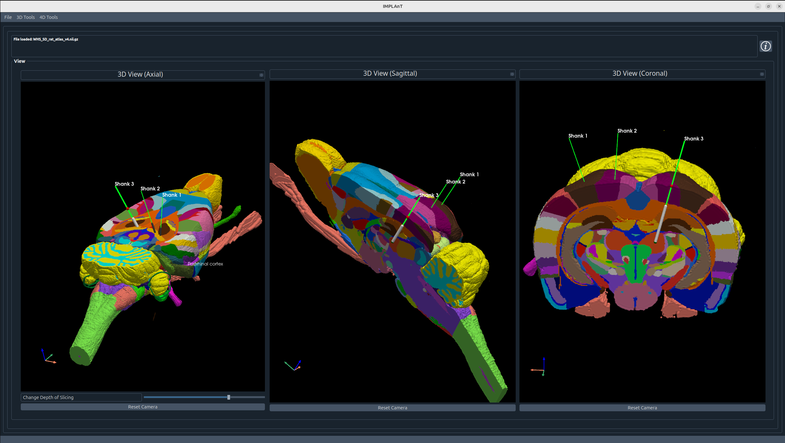
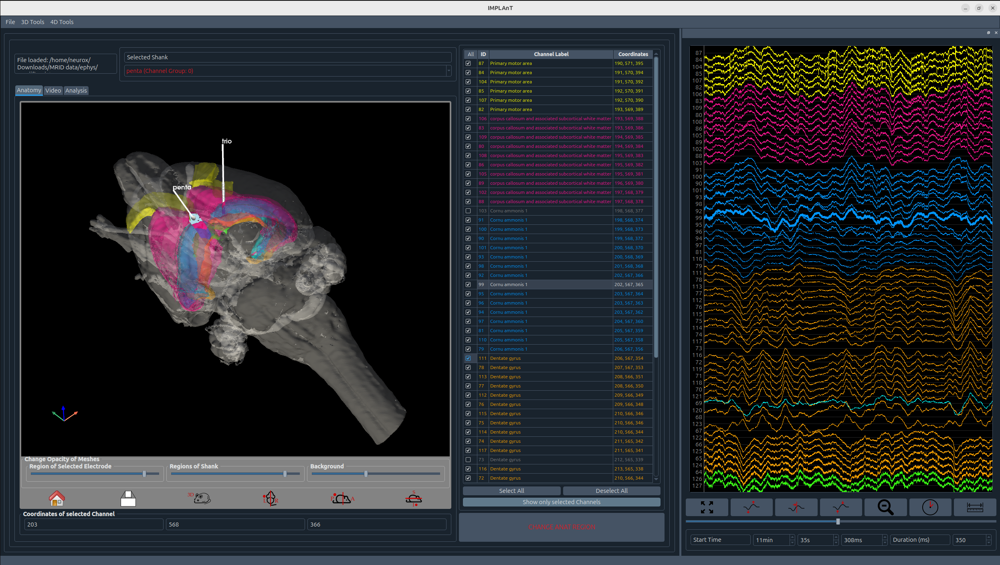

# IMPLAnT - Integrated Multimodal Planning, Localisation, Analysis Toolbox


Intracranical electrode implantation involves three distinct workflows: surgical planning, post-implant electrode localisation, and electrophysiological analysis. Currently, these steps are carried out through disconnected tools and custom scripts.
IMPLAnT is an open-source graphical user interface (GUI) that unifies all three stages into one single, cohesive platform improving both reproducibility and efficiency.

Currently, the GUI contains the following functions:

- **Pre-surgical planning** - register subject MRI data to the WHS brain atlas, letting you plan and visualise electrode trajectories beforre surgery
- **Post-implant localisation** - uses semi-supervised pipeline for MR identification tags to localise electrodes after implantation and automatically assign atlas-defined region labels to each channel to facilitate a more accurate analysis 
- **Electrophysiology data visualisation** - visualises and curates signal data channel-by-channel, directly linked to the anatomical labels from previous steps

Electrophysiology data preprocessing and analysis is planned to be implemented in the next few weeks.
As far as we are aware, IMPLAnT is the first open-source tool to bridge this entire pipeline in one interfce. It is released fully open-source and designed to adapt to a range of experimental protocols.







## Installation

Choose one of two options:
- **Download the release** from the [Releases page](../../releases) — no Python installation needed
- **Run from source** — requires Python and all dependencies

Regardless of which option you choose, **ANTs must be installed separately** (see [Dependencies](#dependencies)).

### Dependencies
IMPLAnT requires **ANTs** (Advanced Normalization Tools) for MRI registration. ANTs is not a Python package and must be installed separately by all users.

1. Download ANTs from the [ANTs releases page](https://github.com/ANTsX/ANTs/releases)
2. Place the ANTs binaries so that the folder structure looks like this:

   **From source:**
   ```
   IMPLAnT/
     ants/
       bin/
         antsRegistration
         antsApplyTransforms
         ...
   ```

   **Standalone application:**
   ```
   IMPLAnT  (executable)
   ants/
     bin/
       antsRegistration
       antsApplyTransforms
       ...
   ```

### From source
1. Clone the repository
   ```
   git clone git@github.com:Neurotechnology-at-ETH-Zurich/IMPLAnT.git
   ```
2. Install dependencies
   ```
   cd IMPLAnT
   pip install -r requirements.txt
   ```
3. Install ANTs as described above

4. Run the app
   ```
   python main_window.py
   ```
   Alternatively, in Qt Creator: open the project and press Ctrl+R

### Standalone application

1. Install dependencies and ANTs as described above
2. Build the executable
   ```
   pyinstaller MRID_GUI.spec
   ```
3. The app is created at `dist/IMPLAnT`
4. Place the `ants/bin/` folder next to the executable as described in [Dependencies](#dependencies)

