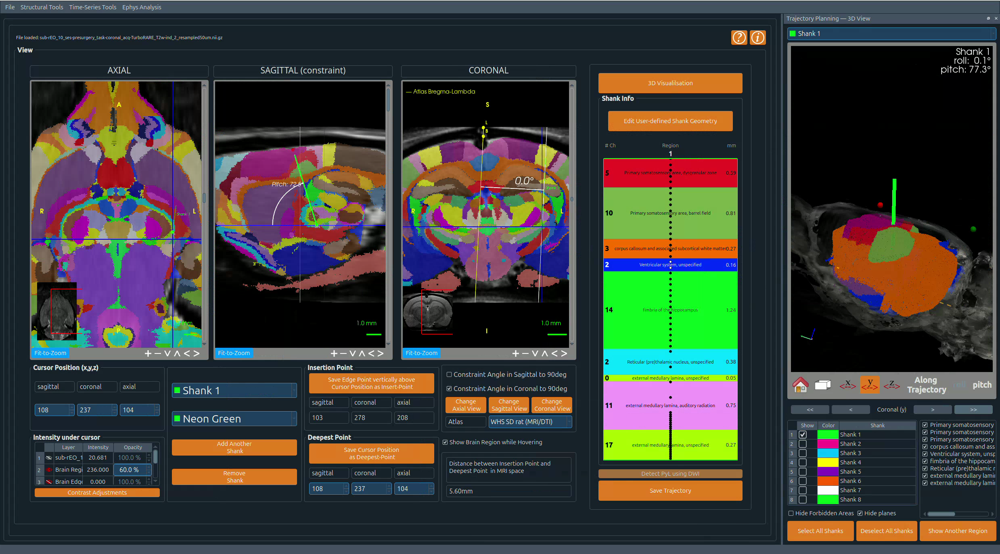
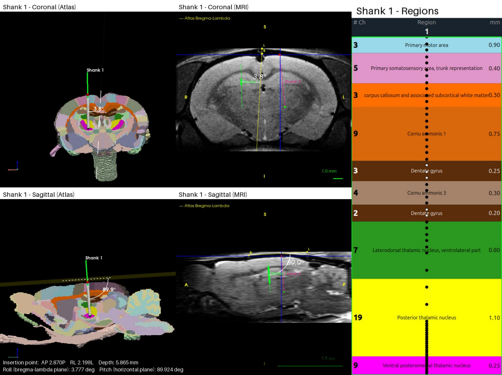

# IMPLAnT - Integrated Multimodal Planning, Localisation, Analysis Toolbox


Intracranial electrode implantation involves three distinct workflows: surgical planning, post-implant electrode localisation, and electrophysiological analysis. Currently, these steps are carried out through disconnected tools and custom scripts.
IMPLAnT is an open-source graphical user interface (GUI) that unifies all three stages into one single, cohesive platform, improving both reproducibility and efficiency.

The GUI currently provides:

- **Pre-surgical planning** — register subject MRI data to the WHS brain atlas, letting you plan and visualise electrode trajectories before surgery — switch between the bundled MRI/DTI atlas and a higher-resolution microscopy atlas at any time (see [Atlas](#atlas))
- **Post-implant localisation** — uses a semi-supervised pipeline for MR identification tags to localise electrodes after implantation and automatically assign atlas-defined region labels to each channel to facilitate a more accurate analysis
- **Electrophysiology data visualisation & analysis** — visualises and curates signal data channel-by-channel, directly linked to the anatomical labels from previous steps; includes theta-event detection, ripple detection (Rippl AI), and a spike-raster view for externally computed spike-sorting results

Further electrophysiology preprocessing and analysis features are planned for future releases.
As far as we are aware, IMPLAnT is the first open-source tool to bridge this entire pipeline in one interface. It's designed to adapt to a range of experimental protocols.


## Screenshots

**Pre-surgical trajectory planning** — plan and visualise electrode trajectories across axial, sagittal, and coronal views of the WHS rat brain atlas, with individual shanks labelled directly in 3D.



**Post-implant electrode localisation** — paint anatomical regions and electrode traces across the post-implant MRI, generating a heatmap that is used to automatically assign each recording channel to its atlas-defined brain region.


**Electrophysiology visualisation** — view raw signal traces colour-coded by atlas region alongside a 3D rendering of the implanted electrodes, with per-channel anatomical labels and coordinates.


## Requirements

- **OS**: Linux (tested on Ubuntu 24) or macOS (dependencies pinned for both). Pre-built releases are available for both Linux and **Apple Silicon** Macs (M1/M2/M3+) — not Intel Macs, which need a from-source build instead. The macOS build is unsigned/not notarized, so the first launch needs a right-click → Open (or `xattr -cr` if macOS reports it as damaged after a transfer).
- **Python**: 3.10 (from source only)
- **ANTs**: required to build from source or to build the standalone executable yourself (see [Dependencies](#dependencies)) — **not** required just to run a pre-built release, its binaries are bundled in
- **ffprobe** (part of FFmpeg): required to run from source, for video frame-rate detection in the Electrophysiology visualisation tab (see [Dependencies](#dependencies)) — **not** required for a pre-built release, it's bundled in the same way as ANTs
- **Internet connection**: needed the *first* time you open ephys data, start SAMRI registration, or start trajectory planning — IMPLAnT downloads and caches the ~1.3GB reference atlas automatically at that point (see [Atlas files](#atlas-files)). Not needed to just browse a 3D/4D MRI volume, and not needed again once the atlas is cached locally.

## Installation

Choose one of two options:
- **Download the release** from the [Releases page](../../releases) — pre-built standalone executables for **Linux** and **macOS (Apple Silicon)**; no Python installation or separate ANTs install needed. Configure `paths_config.json` as described in [Configuration](#configuration).
- **Run from source** — requires Python 3.10, all dependencies, and a local ANTs install (see [Dependencies](#dependencies))

### Dependencies
IMPLAnT requires **ANTs** (Advanced Normalization Tools) for MRI registration. ANTs is not a Python package. Running from source, or building the standalone executable yourself, needs a local ANTs install; the pre-built releases already bundle the specific ANTs tools they call, so if you're just downloading a release you can skip this section.

1. Download ANTs from the [ANTs releases page](https://github.com/ANTsX/ANTs/releases)
2. Place the ANTs binaries so that the folder structure looks like this — this is the same layout whether you're running from source directly or building the standalone executable (`MRID_GUI.spec` reads its ANTs binaries from here at build time):
   ```
   IMPLAnT/
     ants/
       bin/
         antsRegistration
         antsApplyTransforms
         ...
   ```

IMPLAnT also uses **ffprobe** (part of FFmpeg) to read a video's frame rate/frame count in the Electrophysiology visualisation tab's video player. This is separate from video *playback* itself, which goes through Qt's own bundled multimedia backend and needs nothing extra.

- **Running from source**: install FFmpeg via your OS package manager, e.g. `sudo apt install ffmpeg` (Ubuntu/Debian) or `brew install ffmpeg` (macOS) — this puts `ffprobe` on your `PATH`, which is all IMPLAnT needs.
- **Building the standalone executable yourself**: place a copy of the `ffprobe` binary so the folder structure looks like this (same convention as `ants/bin/` above; `MRID_GUI.spec` reads it from here at build time):
  ```
  IMPLAnT/
    ffmpeg/
      bin/
        ffprobe
  ```
- **Downloading a pre-built release**: nothing to do, `ffprobe` is already bundled in.

### From source
1. Clone the repository, including its submodules (`electrode2geometry`, `rippl-AI`)
   ```
   git clone --recurse-submodules git@github.com:Neurotechnology-at-ETH-Zurich/IMPLAnT.git
   cd IMPLAnT
   ```
   If you already have a clone without them, fetch the submodules into it with:
   ```
   git submodule update --init --recursive
   ```
2. Create a Python 3.10 virtual environment and install dependencies into it
   ```
   python3.10 -m venv .venv
   source .venv/bin/activate
   python -m pip install -r requirements.txt
   ```
3. Install ANTs as described above

4. Run the app
   ```
   python main_window.py
   ```
   Alternatively, run it from Qt Creator — see [Qt Creator](#qt-creator) below.

### Qt Creator

To open the project in Qt Creator, e.g. on a new machine:

1. Open `MRID-GUI.creator` (double-click it, or File → Open File or Project, then select `MRID-GUI.creator` as the project file — not one of the other `MRID-GUI.*` files alongside it, e.g. `.files`/`.includes`/`.config`, which are supporting files Qt Creator reads automatically once `.creator` is opened) — Qt Creator picks up `MRID-GUI.files` alongside it automatically as a Generic Project.
2. Click the **Projects** icon in the left sidebar (wrench icon) to open the Build & Run settings, then on the **Build Settings** tab set **Build Directory** to the repository root. This has nothing to do with `pyinstaller`/`MRID_GUI.spec`, and doesn't build anything — it's Qt Creator's Generic Project Manager requiring this field for every project type, Python included, even though there's no real build step to point it at here.
3. **Projects → Run Settings**, on the "Custom Executable" run configuration, set:
   - **Executable**: `.venv/bin/python` (the virtual environment created above)
   - **Arguments**: `main_window.py`
   - **Working directory**: the repository root (not the venv folder)
4. Press Ctrl+R to run, or Ctrl+F5 to debug — Qt Creator reuses the same Executable/Arguments/Working directory for both, there's nothing extra to set for debugging.

These settings are stored per-machine in `MRID-GUI.creator.user`, so redo steps 2–4 on each new machine.

### Building the standalone application

Pre-built Apple Silicon and Linux executables are already published on the [Releases page](../../releases) — only build your own if you need an Intel Mac build, or a build from a specific commit.

1. Install ANTs and ffprobe as described above — these are build-time requirements for whoever runs the steps below, not for whoever later downloads/runs the resulting `dist/IMPLAnT`; `MRID_GUI.spec` bundles the specific ANTs tools and ffprobe the app calls straight into the build automatically
2. Build the executable
   ```
   pyinstaller MRID_GUI.spec
   ```
3. On Linux, the app is created at `dist/IMPLAnT`, ready to distribute as-is. On macOS, building also produces `dist/IMPLAnT.app`; it's unsigned (no Apple Developer ID certificate involved), so the first launch needs a right-click → Open (or `xattr -cr` if macOS still reports it as damaged/quarantined after being copied to another machine) — distributing it further would need signing and notarization.

## Configuration

### Atlas files

IMPLAnT uses the [Waxholm Space (WHS) rat brain atlas](https://www.nitrc.org/projects/whs-sd-atlas) (5 files, ~1.3GB total).

**Nothing to do here by default.** The first time you open ephys data, start SAMRI registration, or start trajectory planning, IMPLAnT asks to confirm and then downloads + caches these files automatically, into an `atlas/` folder next to `main_window.py` (source) or next to the built executable (standalone) — same convention as `ants/bin/`. This needs an internet connection *once*; every run after that reuses the cached copy with no network access at all. See `mrid_utils/atlas_fetch.py` if you need to point it at a different source (e.g. a different release/mirror).

If you'd rather set this up yourself instead — e.g. a machine with no internet access, or to reuse an atlas copy you already have on disk — place the 5 files below into that same `atlas/` folder before first use, and the automatic download is skipped entirely (it only ever runs when a file is actually missing):

| File | Description |
|------|-------------|
| `WHS_SD_rat_atlas_v4.nii.gz` | Atlas volume |
| `WHS_SD_rat_atlas_v4.label` | Region labels |
| `WHS_SD_rat_T2star_v1.01.nii.gz` | Template |
| `WHS_SD_rat_DWI_v1.01.nii.gz` | DWI template |
| `WHS_SD_v2_brainmask_bin.nii.gz` | Brain mask |

If you'd rather keep the atlas elsewhere (e.g. a shared cache used by multiple installs), copy `paths_config.example.json` to `paths_config.json` and set `atlas_folder` to an absolute path instead:

```bash
cp paths_config.example.json paths_config.json
```

```json
{
    "ants_bin": "ants/bin",
    "raw_base": "/path/to/raw/data/",
    "atlas_folder": "/path/to/atlas/folder",
    "atlas_volume": "WHS_SD_rat_atlas_v4.nii.gz",
    "atlas_labels": "WHS_SD_rat_atlas_v4.label",
    "atlas_dwi": "WHS_SD_rat_DWI_v1.01.nii.gz",
    "atlas_template": "WHS_SD_rat_T2star_v1.01.nii.gz",
    "atlas_mask": "WHS_SD_v2_brainmask_bin.nii.gz"
}
```

`raw_base` (root directory for raw Bruker data and BIDS output) still needs an absolute path in `paths_config.json` either way — that data is typically large and kept on its own drive/share, so it isn't defaulted to a folder next to the app.

- **From source**: place `paths_config.json` in the repository root
- **Standalone app**: place `paths_config.json` in the same folder as the `IMPLAnT` executable

### Atlas

IMPLAnT can register and plan against either of two atlases:

| Atlas | What it is | Source |
|-------|------------|--------|
| **WHS SD rat (MRI/DTI)** *(default)* | The bundled Waxholm Space atlas described above | Downloaded once, as above |
| **WHS-aligned SWC female rat (microscopy)** | A higher-resolution microscopy atlas, resampled onto the same WHS coordinate grid | Fetched automatically via [BrainGlobe](https://brainglobe.info/) the first time you select it |

Switch between them via **File → Atlas…**, or live from the dropdown on the Trajectory Planning screen itself. The first time you select the microscopy atlas, IMPLAnT downloads and converts it automatically (a one-time step, same idea as the initial WHS atlas download); every switch after that is instant.

### MRID library file

The electrode localization feature requires `mrid_library.pkl`, a lookup file specific to your experimental setup. Place it in the repository root (next to `main_window.py`) or next to the `IMPLAnT` executable. If no file is found, you will be prompted to browse for it manually — click **Save** next to the browse field to remember that path in `paths_config.json` (as `mrid_library`) so it's the default on future runs too.

A dummy `mrid_library.pkl` is included in this repository for testing. It contains placeholder entries for all four supported MRID types (`duo`, `trio`, `quad`, `penta` — bundles of 2, 3, 4, and 5 shanks respectively) with uniform geometry values and can be used to verify the localisation pipeline without real calibration data. Replace it with your own calibrated file before running actual experiments.

### Custom (bent) shank geometry (optional)

IMPLAnT is built for flexible, high-density electrode bundles whose individual shanks physically bend toward a common shaft as they're implanted, rather than the fixed, straight layout of a rigid silicon probe. To plan trajectories and localise channels correctly for this kind of probe, IMPLAnT needs to know its actual *bent* geometry, not just a nominal straight one.

This is handled by the vendored [electrode2geometry](electrode2geometry/README.md) submodule (see [From source](#from-source) above), exposed in-app as the **Edit User-defined Shank Geometry** panel:

1. Load a **DXF file** — a CAD drawing of the probe's contact sites, exported from your probe's design files.
2. Load an **amplifier.xml** (Neuroscope-style channel map) — each channel group in it becomes one shank, with its channel IDs read automatically.
3. Tune the bending model's parameters (bend distance/angle, bundle ratio, bend radii, …) and click **Run bending model** to compute and preview that shank's bent contact positions.
4. **Add current run as shank**, repeating for each shank in the bundle, to assemble the full probe.

The same panel (and the geometry it produces) is shared between two places in the app: **Trajectory Planning**'s Shank Info sidebar (so planned trajectories/depths account for the real bent shape) and **post-implant electrode localisation** (so channel depths are computed against that same geometry per MRID tag). It can also **Export as json** in a Kilosort4-compatible format for downstream spike sorting.

If your probes are standard rigid, straight shanks, you can ignore this entirely — it's an optional refinement for bundle-style probes only.

### Bruker scanner (optional)

If you are fetching raw data directly from a Bruker MRI scanner, copy `samri/bruker_info.example.json` to `samri/bruker_info.json` and fill in your scanner's hostname and password:
```bash
cp samri/bruker_info.example.json samri/bruker_info.json
```
```json
{
    "server": "your-scanner-hostname",
    "password": "your-password"
}
```
`samri/bruker_info.json` is gitignored, never shared, and explicitly excluded from standalone builds (`MRID_GUI.spec` skips it by name when bundling `samri/`) — it never leaves your machine. If you don't use a Bruker scanner, you can skip this entirely — the fields will simply be left blank in the UI.

## Data folder structure

IMPLAnT expects your session data to follow this folder structure. The app derives paths automatically from the file you load, so keeping this layout is important for registration and localisation to work correctly.

```
your-session/
  anat/
    sub-001_T1w_ind_0.nii.gz          ← pre-surgical MRI (main file)
    sub-001_T2w_ind_1.nii.gz          ← post-implant MRI (added via Load Another MRI Image)
    transformation_ind_1-to-ind_0.txt ← registration output (auto-generated)
  registration/                       ← SAMRI registration output (auto-generated)
  analysed/                           ← localisation outputs (auto-generated)
  ephys/
    recording.dat                     ← electrophysiology recording
```

## Usage

IMPLAnT follows a four-stage workflow:

**1. Pre-surgical planning**
1. Open *File → Start SAMRI process* to register the subject MRI to the WHS atlas. Registration time depends on image resolution and the *Num Threads* setting — typically a few hours on a modern workstation with multiple threads.

   
2. Optionally, use *Create Moving Mask* to manually segment a brain mask before registration, which improves accuracy. The mask is saved as `filename-mask.nii.gz`.
3. After successful registration, open *File → Trajectory Planning* and load the pre-surgical MRI. Position shanks in the axial, sagittal, and coronal views until the target regions are reached.
4. Save a *Trajectory Report* — this produces a single PDF that carries the plan forward into the next step, with one page per shank (atlas + real MRI coronal/sagittal views, angles, and a per-channel region breakdown):

   

**2. Intraoperative**

On the day of surgery, real bregma/lambda measurements taken on the animal rarely match exactly what was picked on the pre-op MRI. *File → Intraoperative* opens the same Load Previous Session picker used throughout the app — pick a prior surgery session, or use *Load New File...* to load a saved Trajectory Report PDF instead. Type the manipulator's measured Bregma/Lambda (RL/AP, in mm from your rig's null point) to get an updated target position for each shank, shown against a fixed dorsal skull reference diagram marked with Bregma, Lambda, and each shank's planned insertion point. See [`docs/surgery_workflow.md`](docs/surgery_workflow.md) for the full walkthrough.

**3. Post-implant electrode localisation**
1. Load the pre-surgical MRI via *File → Load MRI Image*.
2. Add the post-implant MRI via *File → Load Another MRI Image*.
3. Use *Structural Tools → Resample* to resample the post-implant image to 50 µm, then *Structural Tools → Register* to register it to the pre-surgical data. The resulting transform file is saved automatically to the `anat/` folder. Registration needs at least 4 slices in each direction.
4. Re-open the GUI via *File → Load MRI Image* and load the 4D post-implant MRI (containing multiple timestamps).
5. Start the localisation via *Time-Series Tools → MRID-tag label creation*. First paint the anatomical regions, then the electrode traces to generate a heatmap.
6. Combined with the atlas registration and the implanted shank's `.pkl` file, IMPLAnT automatically assigns each channel to its atlas-defined brain region.

**4. Electrophysiology visualisation & analysis**
1. Load your recording via *File → Load ephys data*.
2. Channels are displayed with their anatomical labels from the localisation step, allowing direct comparison of signal traces across brain regions.
3. Use the *Ephys Analysis* menu for signal analysis: *Theta Detection* and *Rippl AI* run detection directly on the loaded recording, and *Show Spiking Raster Plot* overlays externally computed spike-sorting results (a JRCLUST `_res.mat` file).
4. Further preprocessing and analysis features are planned for future releases.

## License

This project is licensed under the MIT License — see the [LICENSE](LICENSE) file for details.

It vendors [SAMRI](https://github.com/IBT-FMI/SAMRI) (`samri/`), which is licensed under the GPLv3 (see [`samri/LICENSE`](samri/LICENSE)) — see [NOTICE.md](NOTICE.md) for what that means for the standalone build.

