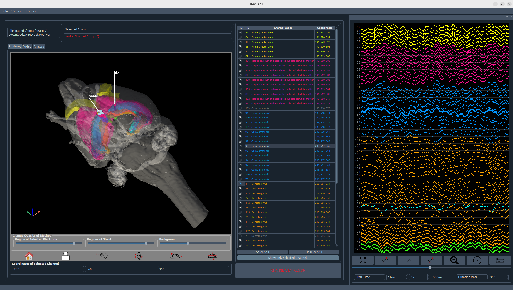

# IMPLAnT
{: .fs-9 }

Integrated Multimodal Planning, Localisation, Analysis Toolbox
{: .fs-6 .fw-300 }

[Get started](installation){: .btn .btn-primary .fs-5 .mb-4 .mb-md-0 .mr-2 }
<a href="download" id="direct-download-btn" class="btn fs-5 mb-4 mb-md-0 mr-2" onclick="return implantDirectDownload(event)">Direct Download</a>
[Download on GitHub](https://github.com/Neurotechnology-at-ETH-Zurich/IMPLAnT/releases){: .btn .fs-5 .mb-4 .mb-md-0 }

---

Intracranial electrode implantation for in vivo electrophysiology involves three distinct workflows: MRI-guided stereotaxic surgical planning, post-implant electrode localisation, and electrophysiological analysis. Across the field, these steps are usually carried out through disconnected tools and custom scripts.

IMPLAnT (Integrated Multimodal Planning, Localisation, Analysis Toolbox) is an open-source graphical user interface (GUI) that unifies all three stages — from probe/electrode trajectory planning against a rodent brain atlas, through MRI-based electrode localisation, to electrophysiology visualisation — into one single, cohesive platform, improving both reproducibility and efficiency for neuroscience labs. As far as we are aware, it is the first open-source tool to bridge this entire pipeline in one interface.

## What it does

- **Pre-surgical planning** — register subject MRI data to the Waxholm Space (WHS) rat brain atlas, letting you plan and visualise multi-shank electrode trajectories before surgery, with a switchable [MRI or microscopy atlas](configuration#atlas).
- **Intraoperative correction** — re-anchor the planned targets to bregma/lambda measured on the animal on surgery day, so pre-op MRI planning still holds up against real stereotaxic coordinates.
- **Post-implant localisation** — a semi-supervised pipeline for MR identification (MRID) tags localises electrodes after implantation and automatically assigns atlas-defined brain region labels to each recording channel.
- **Electrophysiology visualisation & analysis** — visualise and curate signal data channel-by-channel, directly linked to the anatomical labels from previous steps, with built-in theta-event detection, ripple detection, and a spike-raster view for externally computed spike-sorting results.

Further electrophysiology preprocessing and analysis features are planned for future releases.

## Screenshots

**Pre-surgical trajectory planning** — plan and visualise electrode trajectories across axial, sagittal, and coronal views of the subject's own MRI, registered to the WHS rat brain atlas for region labels, with individual shanks labelled directly in 3D.

**Post-implant electrode localisation** — paint anatomical regions and electrode traces across the post-implant MRI, generating a heatmap used to automatically assign each recording channel to its atlas-defined brain region.

**Electrophysiology visualisation & analysis** — view raw signal traces colour-coded by atlas region alongside a 3D rendering of the implanted electrodes, with per-channel anatomical labels and coordinates.

## License

IMPLAnT is released under the [MIT License](https://github.com/Neurotechnology-at-ETH-Zurich/IMPLAnT/blob/main/LICENSE).
