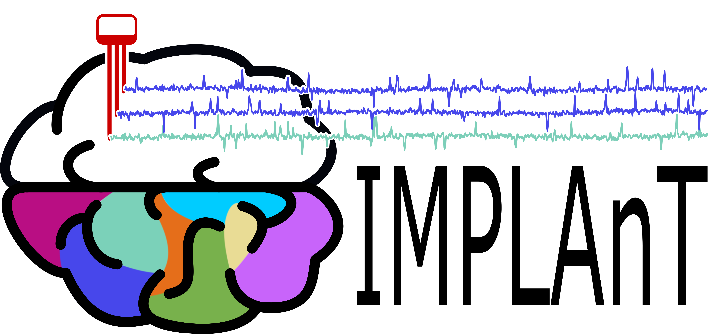

# IMPLAnT
{: .fs-9 }

Integrated Multimodal Planning, Localisation, Analysis Toolbox
{: .fs-6 .fw-300 }

[Get started](installation){: .btn .btn-primary .fs-5 .mb-4 .mb-md-0 .mr-2 }
[Download the latest release](https://github.com/Neurotechnology-at-ETH-Zurich/IMPLAnT/releases){: .btn .fs-5 .mb-4 .mb-md-0 }

---

Intracranial electrode implantation involves three distinct workflows: surgical planning, post-implant electrode localisation, and electrophysiological analysis. Currently, these steps are carried out through disconnected tools and custom scripts.

IMPLAnT is an open-source graphical user interface (GUI) that unifies all three stages into one single, cohesive platform, improving both reproducibility and efficiency. As far as we are aware, it is the first open-source tool to bridge this entire pipeline in one interface.

## What it does

- **Pre-surgical planning** — register subject MRI data to the WHS brain atlas, letting you plan and visualise electrode trajectories before surgery.
- **Post-implant localisation** — a semi-supervised pipeline for MR identification tags localises electrodes after implantation and automatically assigns atlas-defined region labels to each channel.
- **Electrophysiology data visualisation** — visualise and curate signal data channel-by-channel, directly linked to the anatomical labels from previous steps.

Electrophysiology data preprocessing and analysis is planned for a future release.

## Screenshots

**Pre-surgical trajectory planning** — plan and visualise electrode trajectories across axial, sagittal, and coronal views of the WHS rat brain atlas, with individual shanks labelled directly in 3D.

**Post-implant electrode localisation** — paint anatomical regions and electrode traces across the post-implant MRI, generating a heatmap used to automatically assign each recording channel to its atlas-defined brain region.

**Electrophysiology visualisation** — view raw signal traces colour-coded by atlas region alongside a 3D rendering of the implanted electrodes, with per-channel anatomical labels and coordinates.

## License

IMPLAnT is released under the [MIT License](https://github.com/Neurotechnology-at-ETH-Zurich/IMPLAnT/blob/main/LICENSE).
