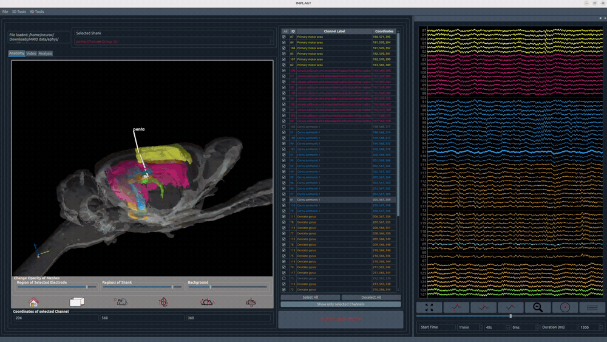

# Electrophysiology visualisation

1. Load your recording via **File → Load ephys data**.
2. Channels are displayed with their anatomical labels from the [localisation step](post-implant-localisation), allowing direct comparison of signal traces across brain regions.
3. Electrophysiology data preprocessing and analysis is planned for a future release.

