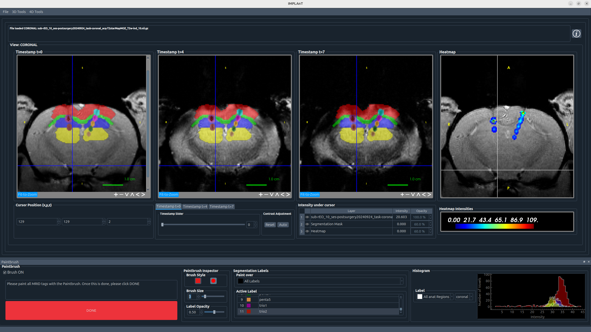

# Post-implant localisation

1. Load the pre-surgical MRI via **File → Load MRI Image**.
2. Add the post-implant MRI via **File → Load Another MRI Image**.
3. Use **3D Tools → Resample** to resample the post-implant image to 50 µm, then **3D Tools → Register** to register it to the pre-surgical data. The resulting transform file is saved automatically to the `anat/` folder. Registration needs at least 4 slices in each direction.
4. Re-open the GUI via **File → Load MRI Image** and load the 4D post-implant MRI (containing multiple timestamps).
5. Start the localisation via **4D Tools → MRID-tag label creation**. First paint the anatomical regions, then the electrode traces to generate a heatmap.
6. Combined with the atlas registration and the implanted shank's `.pkl` file, IMPLAnT automatically assigns each channel to its atlas-defined brain region.

See [Configuration](../configuration#mrid-library-file) for details on the `mrid_library.pkl` lookup file this pipeline needs.

---

Next: [Electrophysiology visualisation](ephys-visualisation)
