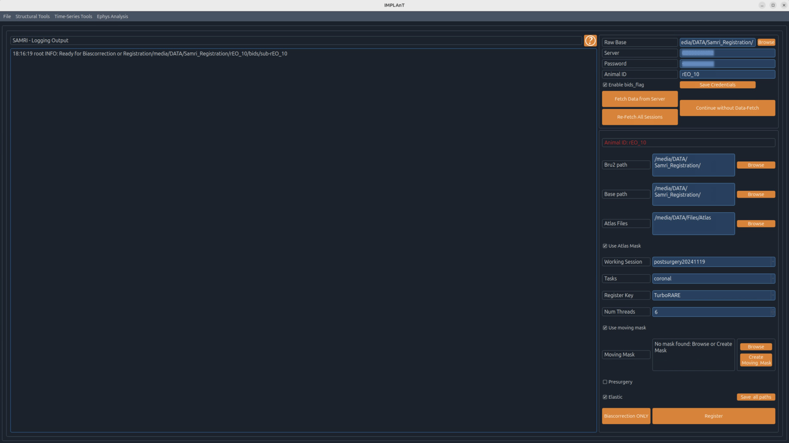

# Pre-surgical planning

1. Open **File → Start SAMRI process** to register the subject MRI to the WHS atlas. Registration time depends on image resolution and the *Num Threads* setting — typically a few hours on a modern workstation with multiple threads.

   
2. Optionally, use **Create Moving Mask** to manually segment a brain mask before registration, which improves accuracy. The mask is saved as `filename-mask.nii.gz`.
3. After successful registration, open **File → Trajectory Planning** and load the pre-surgical MRI. Position shanks in the axial, sagittal, and coronal views until the target regions are reached.
4. If you're implanting a flexible, bundle-style probe (rather than a rigid straight shank), use **Edit User-defined Shank Geometry** in the Shank Info sidebar to define its actual bent geometry from a DXF file first — see [Configuration](../configuration#custom-bent-shank-geometry-optional).
5. Save a **Trajectory Report** — this produces a single PDF that carries the plan forward into the next step.

The saved PDF does two things at once:

- **A human-readable report** — one page per shank (coronal/sagittal views with a numeric caption), a shank geometry page, and a summary page.
- **A machine-readable copy of the plan**, embedded invisibly inside the same PDF — this is what the [Intraoperative](intraoperative) tab reads back on surgery day.

{: .note }
The PDF is named after the animal (e.g. `trajectory_planning-sub-X-ind_2.pdf`) and, importantly, is saved in the **same folder as the MRI scan it came from** — the Intraoperative tab locates the scan automatically using that folder plus the animal's `ind_N` id. Keep the PDF alongside the scan rather than moving it elsewhere.

<video src="../assets/videos/Trajectory_Planning_Demo.mp4" controls muted loop playsinline style="max-width:100%"></video>

**One page of a saved Trajectory Report** — atlas and real MRI coronal/sagittal views for a shank, with the insertion angle overlaid and a per-channel region breakdown:

---

Next: [Intraoperative](intraoperative)
